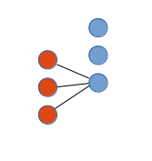

Modeling categorical features using NN's
========================================

This project contains a small sample of a neural net modeled with Keras. 
The gist of the project is that categorical features are modelled by replacing each categorical feature with a mini net built of one dummy feature per level and on top one linear node. See the image for a visual hint:

This is a practical example of how NN can be made to shape data.

Note
----
The data files are not included, these are part of a Kaggle competition.

Dependencies
------------

* Keras
* TensorFlow
* hd5py
* numpy
* pandas
* sklearn# keras-categorical
